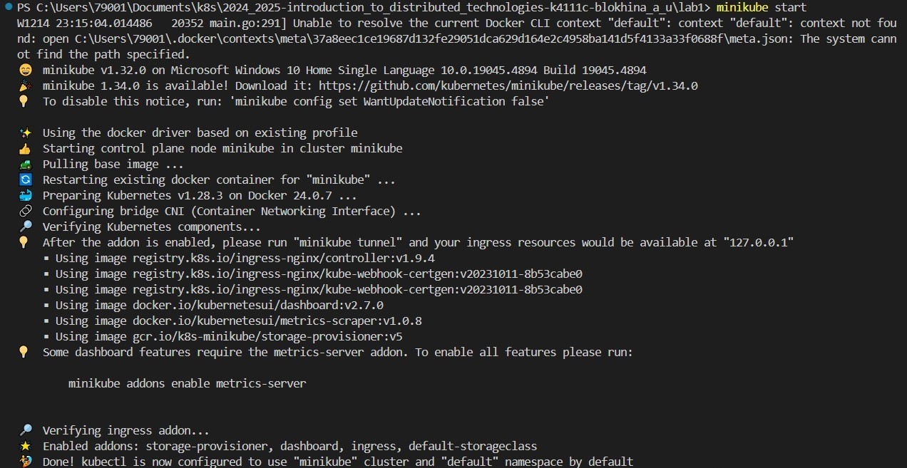
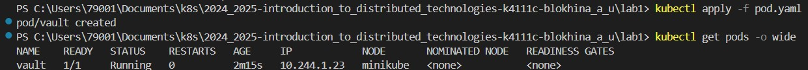
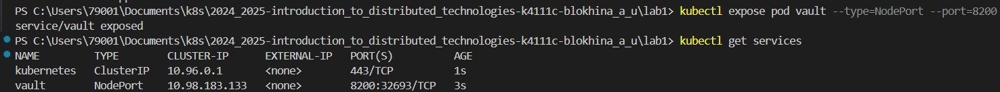
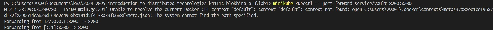
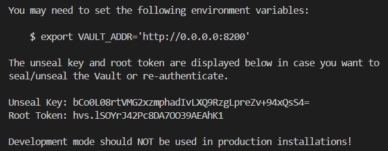
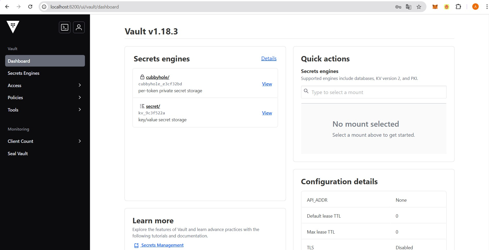

University: [ITMO University](https://itmo.ru/ru/)
<br>Faculty: [FICT](https://fict.itmo.ru)
<br>Course: [Introduction to distributed technologies](https://github.com/itmo-ict-faculty/introduction-to-distributed-technologies)
<br>Year: 2024/2025
<br>Group: K4111c
<br>Author: Blokhina Anastasia Yurevna
<br>Lab: Lab1
<br>Date of create: 10.12.2024
<br>Date of finished: 19.12.2024

# Лабораторная работа №1 "Установка Docker и Minikube, мой первый манифест"

## Цель работы

Ознакомиться с инструментами Minikube и Docker, развернуть свой первый "под".

## Ход работы

1. Создадим кластер minikube

> <br><br/>

2. Напишем yaml-файл для развертывания пода HashiCorp Vault. В манифесте указываем, что создаем объект типа Pod, даем ему имя и метку vault, для создания контейнера будет использоваться образ hashicorp/vault, доступный на Docker Hub, контейнер будет слушать на порту 8200

```
apiVersion: v1
kind: Pod
metadata:
  name: "vault"
  labels:
    app: vault
spec:
  containers:
  - name: vault
    image: hashicorp/vault
    ports:
    - containerPort:  8200
```

3. Применим манифест. В нашем кластере запустился под

   > <br><br/>

4. Для доступа к приложению, работающему внутри пода, создадим сервис. Для этого используем команду `kubectl expose`. Сервис NodePort будет перенаправлять трафик на порт 8200 пода.

   > <br><br/>

5. Чтобы получить доступ к приложению, используем команду для перенаправления порта

   > <br><br/>

6. Перейдем по ссылке http://localhost:8200. Чтобы войти потребуется токен, найти который можем проанализировав логи

   > kubectl logs vault

   > <br><br/>

7. Указываем `root token` и успешно заходим
   <br><br/>
8. Схема
   <br><br/>

## Вопросы

1. Что сейчас произошло и что сделали команды указанные ранее?

   Развернули приложение HashiCorp Vault в Minikube, используя Docker image. Для доступа к приложению создали сервис и настроили проброс порта 8200 с localhost на порт 8200 в контейнере.

2. Где взять токен для входа в Vault?

   По умолчанию root-токен хранится в логах.
