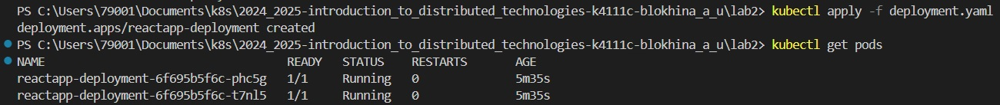
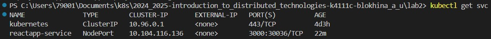
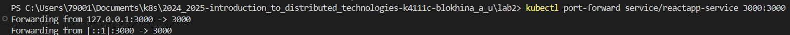
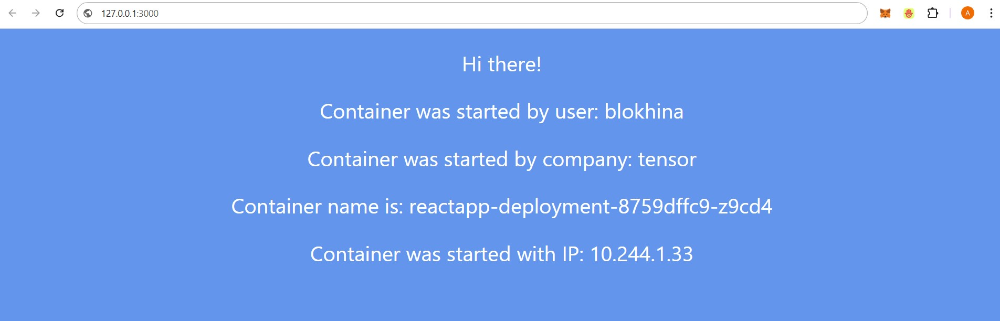
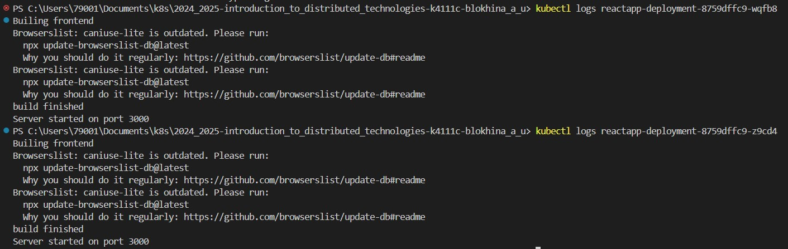
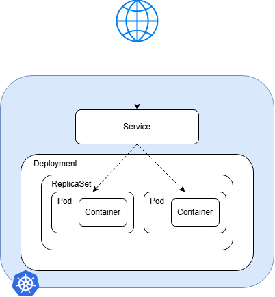

University: [ITMO University](https://itmo.ru/ru/)
<br>Faculty: [FICT](https://fict.itmo.ru)
<br>Course: [Introduction to distributed technologies](https://github.com/itmo-ict-faculty/introduction-to-distributed-technologies)
<br>Year: 2024/2025
<br>Group: K4111c
<br>Author: Blokhina Anastasia Yurevna
<br>Lab: Lab1
<br>Date of create: 12.12.2024
<br>Date of finished: 19.12.2024

# Лабораторная работа №2 "Развертывание веб сервиса в Minikube, доступ к веб интерфейсу сервиса. Мониторинг сервиса"

## Цель работы

Ознакомиться с типами "контроллеров" развертывания контейнеров, ознакомится с сетевыми сервисами и развернуть свое веб приложение.

## Ход работы

1. Создадим манифест, в котором опишем Deployment – ресурс Kubernetes, предназначенный для развертывания приложений и их обновления декларативным образом. Он является рекомендуемым способом создания и масштабирования подов

```
apiVersion: apps/v1
kind: Deployment
metadata:
  name: reactapp-deployment
spec:
  replicas: 2
  selector:
    matchLabels:
      app: reactapp
  template:
    metadata:
      labels:
        app: reactapp
    spec:
      containers:
      - name: reactapp-container
        image: ifilyaninitmo/itdt-contained-frontend:master
        ports:
        - containerPort:  3000
        env:
        - name: REACT_APP_USERNAME
          value: "blokhina"
        - name: REACT_APP_COMPANY_NAME
          value: "tensor"
```

2. В манифесте мы задали количество реплик (2 штуки) и метки для подов, соответствующих шаблону. После его применения в кластере запустилось 2 пода

> <br><br/>

3. По умолчанию под доступен только при обращении по его внутреннему ip-адресу внутри кластера. Чтобы сделать контейнер доступным вне виртуальной сети Kubernetes, необходимо представить под как Service Kubernetes. Создадим YAML-файл, в котором его опишем

```
apiVersion: apps/v1
kind: Service
metadata:
 name: reactapp-service
spec:
  selector:
    app: reactapp
  type: NodePort
  ports:
  - name: http
    port: 3000
    nodePort: 30036
    protocol: TCP
```

4. Применим манифест

   > <br><br/>

5. Чтобы получить доступ к приложению с localhost, пробросим порты

   > <br><br/>

6. Перейдем в браузер. Переменные `REACT_APP_USERNAME` и `REACT_APP_COMPANY_NAME` остаются такими же, какими были заданы в `deployment.yaml` и передаются в каждый контейнер при его запуске. Поскольку вы не изменяете эти переменные после запуска deployment, они останутся такими же во всех репликах.

   > <br><br/>

7. Проверим логи контейнеров. Они одинаковые

   > <br><br/>

8. Схема
   <br><br/>
