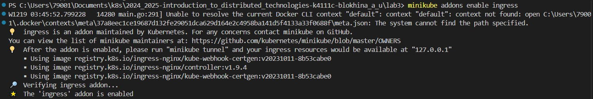
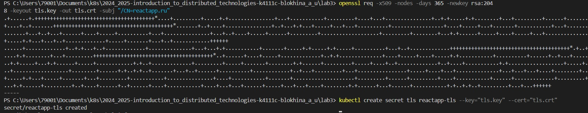
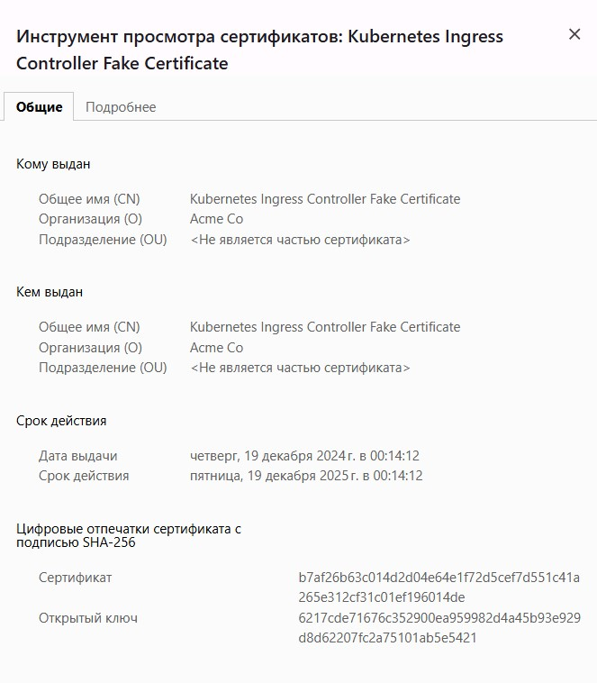
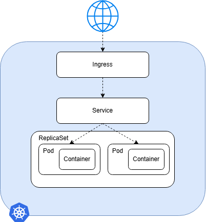

University: [ITMO University](https://itmo.ru/ru/)
<br>Faculty: [FICT](https://fict.itmo.ru)
<br>Course: [Introduction to distributed technologies](https://github.com/itmo-ict-faculty/introduction-to-distributed-technologies)
<br>Year: 2024/2025
<br>Group: K4111c
<br>Author: Blokhina Anastasia Yurevna
<br>Lab: Lab1
<br>Date of create: 19.12.2024
<br>Date of finished: 19.12.2024

# Лабораторная работа №3 "Сертификаты и "секреты" в Minikube, безопасное хранение данных"

## Цель работы

Познакомиться с сертификатами и "секретами" в Minikube, правилами безопасного хранения данных в Minikube.

## Ход работы

1. Создадим `configMap` и пропишем в нем переменные `REACT_APP_USERNAME`, `REACT_APP_COMPANY_NAME`

```
apiVersion: v1
kind: ConfigMap
metadata:
  name: reactapp-config
data:
  REACT_APP_USERNAME: "blokhina"
  REACT_APP_COMPANY_NAME: "tensor"
```

2. Для запуска двух реплик приложения React в этот раз будем использовать `ReplicaSet`. Переменные окружения возьмем из внешнего источника - `configMap`.

```
apiVersion: apps/v1
kind: ReplicaSet
metadata:
  name: reactapp-replicaset
spec:
  replicas: 2
  selector:
    matchLabels:
      app: reactapp
  template:
    metadata:
      labels:
        app: reactapp
    spec:
      containers:
      - name: reactapp-container
        image: ifilyaninitmo/itdt-contained-frontend:master
        ports:
        - containerPort: 3000
        envFrom:
        - configRef:
            name: reactapp-config
```

3. Для `ReplicaSet` создадим `Service` как и в прошлых работах.

4. Применим все манифесты, подключим `Ingress`, активируя соответствующее дополнение

> <br><br/>

5. Для генерации самоподписанного сертификата воспользуемся утилитой openssl. Создадим TLS-секрет, для которого в качестве сертификата и ключа укажем созданные ранее файлы

> <br><br/>

6. Создадим YAML-файл для Ingress

```
apiVersion: networking.k8s.io/v1
kind: Ingress

metadata:
  name: reactapp-ingress
  annotations:
    nginx.ingress.kubernetes.io/ssl-redirect: "true"

spec:
  tls:
    - hosts:
      - reactapp.ru
      secretName: reactapp-tls

  rules:
  - host: reactapp.ru
    http:
      paths:
      - path: "/"
        pathType: Prefix
        backend:
          service:
            name: reactapp-service
            port:
              number: 3000
```

7. Пропишем доменное имя reactapp и его ip-адрес (в нашем случае 127.0.0.1) в файле hosts.

8. Применим манифест и не забываем про команду `minikube tunnel`

9. Переходим по адресу https://reactapp.ru, где нас предупреждают о небезопасном переходе на сайт
   <br><br/>
10. Схема
    <br><br/>
