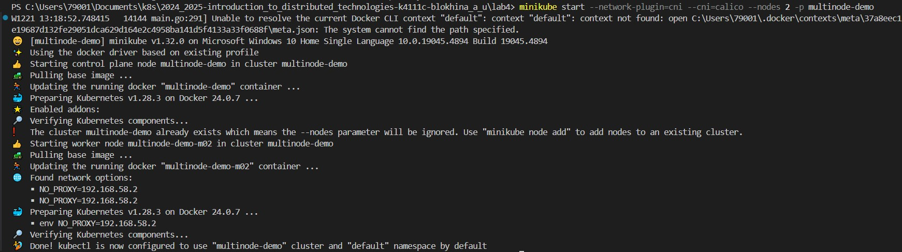
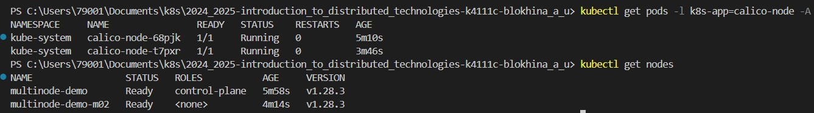
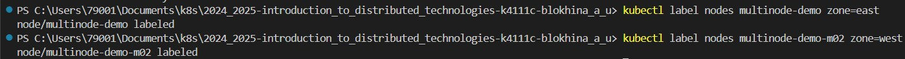
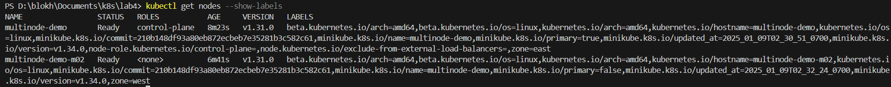
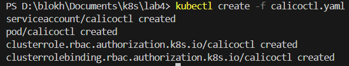
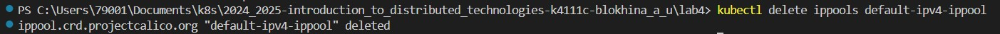
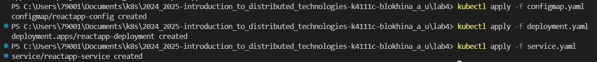
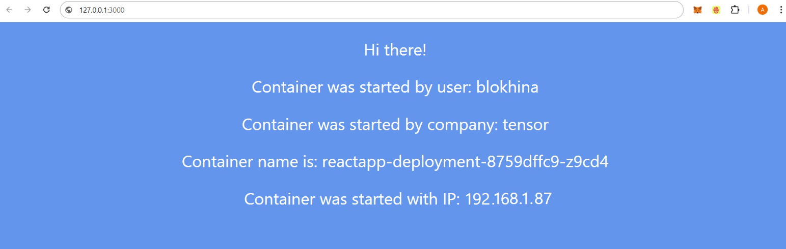
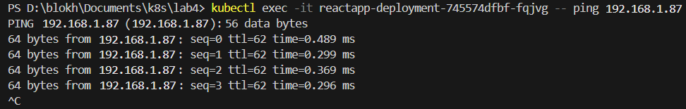
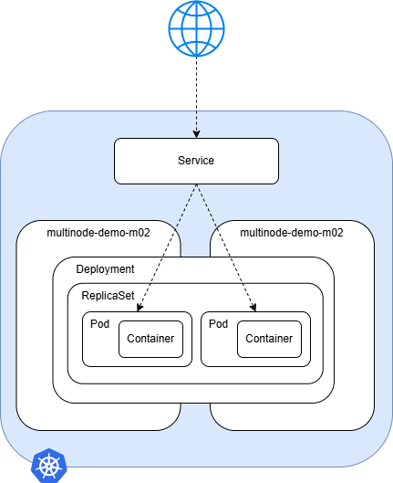

University: [ITMO University](https://itmo.ru/ru/)
<br>Faculty: [FICT](https://fict.itmo.ru)
<br>Course: [Introduction to distributed technologies](https://github.com/itmo-ict-faculty/introduction-to-distributed-technologies)
<br>Year: 2024/2025
<br>Group: K4111c
<br>Author: Blokhina Anastasia Yurevna
<br>Lab: Lab1
<br>Date of create: 19.12.2024
<br>Date of finished: 09.01.2025

# Лабораторная работа №4 "Сети связи в Minikube, CNI и CoreDNS"

## Цель работы

Познакомиться с CNI Calico и функцией IPAM Plugin, изучить особенности работы CNI и CoreDNS.

## Ход работы

1. Установим плагин `CNI=calico` и режим работы `Multi-Node Clusters` 

> <br><br/>

2. Проверим работу CNI плагина Calico и количество нод

> <br><br/>

3. Для запущеных ранее нод укажем `label` по признаку географического расположения

> <br><br/>

4. Выведем результат рабоыт предыдущей команды

> <br><br/>

5. Создадим манифест для Calico, который будет назначать на основе меток IP-адреса из определенных пулов 

```
apiVersion: projectcalico.org/v3
kind: IPPool
metadata:
  name: east-ippool
spec:
  cidr: 192.168.0.0/24
  ipipMode: Always
  natOutgoing: true
  nodeSelector: zone == "east"
---
apiVersion: projectcalico.org/v3
kind: IPPool
metadata:
  name: west-ippool
spec:
  cidr: 192.168.1.0/24
  ipipMode: Always
  natOutgoing: true
  nodeSelector: zone == "west"
```

6. Чтобы применить манифест IPPool, установим `calicoctl`

> <br><br/>

7. Перед применением манифеста удалим созданные по умолчанию IPPools

> <br><br/>

8. Воспользуемся манифестами из прошлых работ для создания `deployment` с 2 репликами. Также создадим сервис для доступа к `deployment`

> <br><br/>

9. Выполним проброс портов и перейдем по ссылке

> <br><br/>

> <br><br/>

Отображаемые IP адреса соответствуют созданным в данной работе IPPool'ам. 

Переменные Container name и Container IP не меняются, так как используемый севрис не балансирует нагрузку.

10. Выполним ping соседнего пода

> <br><br/>

11. Схема
> <br><br/>
